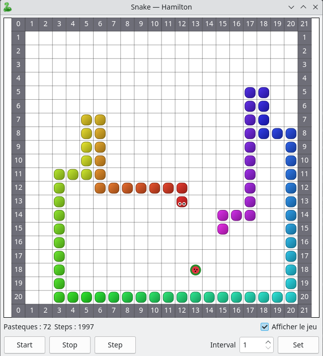

# 🐍 qtiasnake — Snake résolu par IA (cycle hamiltonien + raccourcis)

Un jeu de **Snake** en **C++ / Qt5** qui se joue tout seul : une IA remplit le plateau
**à tous les coups**, en combinant un **cycle hamiltonien** (sécurité garantie) et des
**raccourcis le long du cycle** (vitesse). Le serpent est rendu en dégradé arc-en-ciel
qui « défile » et donne l'impression du mouvement.

Et surtout : en chargeant une image, le serpent **reconstitue cette image** case par case en
remplissant le plateau. 🎨

▶️ **Vidéo de démonstration : https://youtu.be/yIlmqoJil5I**

<p align="center">
  
</p>

> Plateau 22×22 (20×20 cases jouables = **400 cases**). Victoire quand le serpent les remplit
> toutes, soit **396 pastèques** mangées.

---

## ✨ Fonctionnalités

- **IA imbattable** : le solveur gagne systématiquement, sans jamais se piéger.
- **Deux idées fusionnées** : cycle hamiltonien + raccourcis (sauts en avant sur le cycle) bornés par la queue.
- **Rendu soigné** : serpent en billes arrondies, dégradé de teinte tête→queue, yeux orientés
  dans le sens du déplacement, pastèque dessinée en tranche.
- **Compteurs** en temps réel : pastèques mangées et nombre de pas (steps).
- **Contrôles** : Start / Stop / Step, intervalle réglable, affichage désactivable
  (pour laisser tourner l'IA à pleine vitesse).
- **Fins de partie propres** : message de victoire quand le plateau est plein, gel de
  l'affichage en cas de mort pour inspecter la situation.
- **Génération d'image** : charge n'importe quelle image et le serpent la **reconstitue** en
  remplissant le plateau ; rejeu déterministe et export des frames pour en faire une vidéo.

---

## 🎨 Génération d'image

Au-delà de « juste gagner », le solveur peut **peindre une image** : chaque case du plateau
prend la couleur du pixel correspondant de l'image chargée. Quand l'IA a rempli tout le
plateau, l'image apparaît — reconstituée par le parcours du serpent.

Le tout se pilote depuis le menu **Fichier** :

- **Charger une image** — l'image devient l'objectif ; le plateau est redimensionné à ses
  dimensions et l'IA joue jusqu'à la remplir. À la victoire, la partie est **sauvegardée**
  dans un fichier `.sna` (séquence de pastèques + couleurs du serpent).
- **Charger un jeu** — recharge un `.sna` et **rejoue la partie à l'identique** (le jeu est
  déterministe : la même séquence de pastèques reproduit exactement le même tracé, et donc la
  même image).

### 🎬 Export vidéo

La case **Générer images** écrit **une image PNG par pas** dans un dossier `frames/`
(rendu hors-écran à taille fixe, indépendant de l'affichage). On assemble ensuite la vidéo
avec ffmpeg :

```bash
ffmpeg -framerate 15 -i frames/frame_%06d.png -c:v libx264 -pix_fmt yuv420p -crf 18 out.mp4
```

Le résultat en vidéo : **https://youtu.be/yIlmqoJil5I**

---

## 🧠 Comment l'IA fonctionne

Le cœur du projet est dans [`solver.cpp`](solver.cpp).

### 1. Le cycle hamiltonien (la sécurité)

Un **circuit fermé** (serpentin) passe une seule fois par chacune des 400 cases et revient à
son point de départ. Chaque case reçoit un **numéro** `0…399` selon son ordre dans la boucle.

Si le serpent suit toujours `numéro → numéro+1`, son corps occupe une tranche continue de
numéros, la case devant la tête est toujours libre, et la queue se retire pile à temps :
**il ne peut jamais se piéger** et finit par tout manger. Simple et sûr… mais lent.

### 2. Les raccourcis sur le cycle (la vitesse)

À chaque pas, plutôt que d'avancer d'un seul cran, le serpent peut **sauter** vers une case
voisine dont le numéro est **plus loin devant** sur le cycle — un raccourci vers la pastèque.

La règle d'or : **ne jamais rattraper sa propre queue** dans l'ordre du cycle (avec une marge
de sécurité). Tant que la tête reste en arrière de la queue, on peut toujours reprendre le
cycle pur sans danger.

```text
distQueue    = (num[queue]    - num[tête]) mod 400   // toujours ramené dans [0, 399]
distPasteque = (num[pastèque] - num[tête]) mod 400
coupeMax     = min(distPasteque, distQueue - MARGE)

Parmi les voisins libres : prendre celui dont l'avance sur le cycle est
la plus grande tout en restant ≤ coupeMax. Sinon, suivre le cycle.
```

Résultat : **rapide grâce aux raccourcis, invaincu grâce au cycle.** Le tableau des numéros ne
dépend que des dimensions du plateau : il est construit **une seule fois** dans le constructeur
du solveur, puis simplement lu à chaque tick (O(1) par voisin).

---

## 🔧 Compilation & exécution

Prérequis : **Qt 5** (Widgets) et un compilateur C++11.

```bash
# avec qmake
qmake
make
./qtiasnake
```

Ou ouvre `qtiasnake.pro` dans **Qt Creator** et lance (Ctrl+R).

---

## 🎮 Utilisation

| Contrôle            | Effet                                                        |
|---------------------|-------------------------------------------------------------|
| **Start**           | Lance l'IA en continu                                        |
| **Stop**            | Met en pause (réactive le pas-à-pas)                         |
| **Step**            | Avance d'un seul pas                                         |
| **Interval** + **Set** | Règle la vitesse (ms entre deux pas)                     |
| **Afficher le jeu** | Décoche pour tourner sans rendu (IA à vitesse maximale)      |
| **Générer images**  | Pratique pour créer une vidéo :)                             |
| Menu **Fichier → Charger une image** | Reconstitue une image en remplissant le plateau |
| Menu **Fichier → Charger un jeu**    | Rejoue une partie sauvegardée (`.sna`)          |

Les compteurs **Pastèques** et **Steps** se mettent à jour en bas de la fenêtre.

---

## 📁 Structure du projet

| Fichier                       | Rôle                                                     |
|-------------------------------|----------------------------------------------------------|
| `game.{h,cpp}`                | Logique du jeu : plateau, serpent, pastèque, collisions  |
| `solver.{h,cpp}`              | **L'IA** : cycle hamiltonien + raccourcis                |
| `snakewidget.{h,cpp}`         | Rendu Qt du plateau et du serpent dégradé                |
| `mainwindow.{h,cpp}` / `.ui`  | Fenêtre, contrôles, boucle de jeu, compteurs             |
| `main.cpp`                    | Point d'entrée                                            |

---

## 🚀 Pistes d'amélioration

- Réduire le nombre de pas : marge de coupe plus agressive, ou cycle « réparable »
  dynamiquement pour raccourcir davantage.
- Plateaux de tailles variables / rejouables.

---

## 📜 Licence

Projet personnel.
